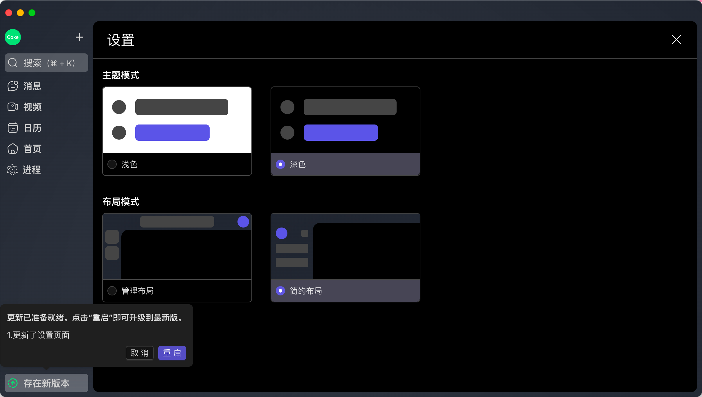

<div align="center">
  
  <h1>Electron React Template</h1>
  <span><a href="./README.md">English</a> | 中文</span>
</div>
## 项目简介

> 基于 Electron + React + TypeScript 的桌面应用模板。

本项目是一个使用 Electron 和 React 构建的桌面应用模板，集成了 TypeScript、Vite、ESLint 等环境，目标是帮助你快速打造一个跨平台桌面应用。




---

## 特性 / Features

- 使用 Vite 作为构建工具，极速开发体验
- 使用 React + TypeScript 构建渲染进程
- 主进程模块化、面向对象封装
- 多环境支持（.env 管理）
- ESLint + Prettier 格式类型检查
- 预设测试环境（可扩展）

---

## 项目结构 / Project Structure

```bash
electron-react-template/
├── public/              # 静态资源
├── electron/            # 主进程代码
│   └── core/            # 核心代码
│   └── manager/         # 窗口、菜单、托盘等
│   └── preload/         # 主进程、渲染层通讯
│   └── updater/         # 更新

├── src/                 # 渲染进程代码
│   └── assest/          # 静态资源
│   └── components/      # 公共组件
│   └── hooks/           # react hooks
│   └── layouts/         # 布局
│   └── router/          # 路由
│   └── styles/          # css 变量
│   └── theme/           # 主题
│   └── views/           # 业务视图代码
├── .env                 # 环境变量文件
├── typings              # 全局类型定义
├── vite.config.ts       # Vite 配置
```

---

## 快速开始

### 1. 安装依赖

```bash
pnpm install
```

### 2. 启动开发模式

```bash
pnpm dev
```

### 3. 构建应用

```bash
pnpm build:mac/win/linux
```

构建产物会生成在 `dist-*` 目录中。

---

## 常用脚本 / Common Scripts

| 命令          | 说明                           |
| ------------- | ------------------------------ |
| `pnpm dev`    | 启动 Electron + React 开发环境 |
| `pnpm build`  | 构建生产版本应用               |
| `pnpm lint`   | 检查代码格式                   |
| `pnpm format` | 格式化代码                     |

---

## 技术栈 / Tech Stack

- [Electron](https://www.electronjs.org/)
- [React](https://react.dev/)
- [Vite](https://vitejs.dev/)
- [TypeScript](https://www.typescriptlang.org/)
- [pnpm](https://pnpm.io/)

---

## 开发建议 / Tips

- 主进程建议使用 class 进行模块化封装（如 MainApp，WindowManager）
- 使用 `preload.ts` 安全地链接主进程和渲染层
- 多环境变量请使用 `.env.[mode]` 文件管理

---

## 许可证

## 本项目基于 MIT 许可证，详见 [LICENSE](LICENSE) 文件。

## 联系我 / Contact

欢迎提 Issue 或 PR，也欢迎关注与交流：

GitHub: [@GJCoke](https://github.com/GJCoke)
