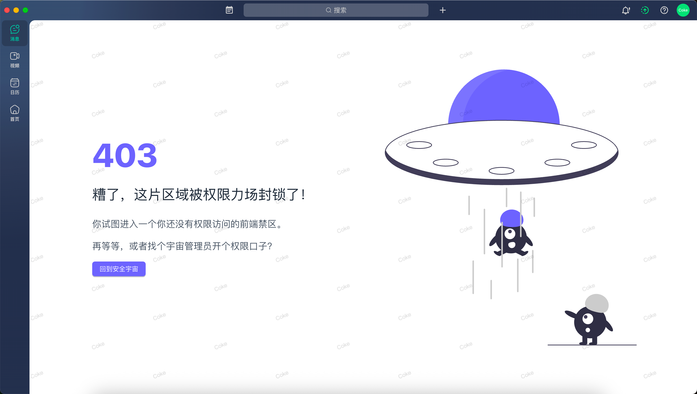
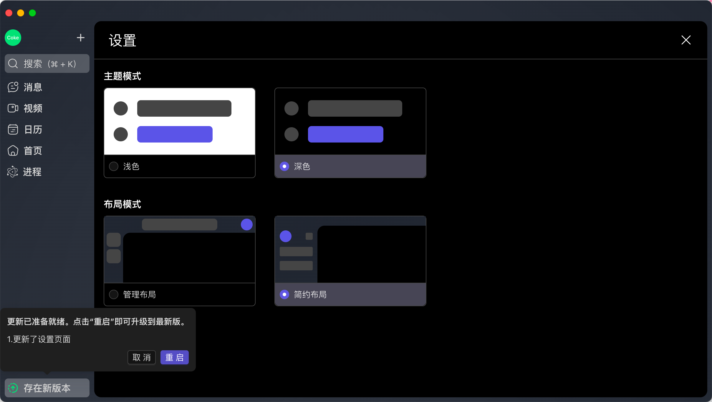

<div align="center">
  
  <h1>Electron React Template</h1>
  <span>English | <a href="./README-CN.md">中文</a></span>
</div>

## Project Overview

> A desktop application template based on Electron + React + TypeScript.

This project is a desktop application template built using Electron and React. It integrates TypeScript, Vite, ESLint, and other modern tools to help you quickly build a cross-platform desktop app.




---

## Features

- Lightning-fast development experience using Vite
- Renderer process built with React + TypeScript
- Modular and object-oriented main process structure
- Multi-environment support via `.env` files
- ESLint + Prettier for formatting and type checking
- Pre-configured testing environment (extensible)

---

## Project Structure

```bash
electron-react-template/
├── public/              # Static assets
├── electron/            # Main process code
│   └── core/            # Core logic
│   └── manager/         # Window, menu, tray managers
│   └── preload/         # Preload scripts for bridging
│   └── updater/         # Update handling

├── src/                 # Renderer process code
│   └── assest/          # Static assets
│   └── components/      # Shared components
│   └── hooks/           # Custom React hooks
│   └── layouts/         # Layout components
│   └── router/          # Routing config
│   └── styles/          # CSS variables
│   └── theme/           # Theme config
│   └── views/           # Business views
├── .env                 # Environment variables
├── typings              # Global type declarations
├── vite.config.ts       # Vite config
```

---

## Getting Started

### 1. Install dependencies

```bash
pnpm install
```

### 2. Start development

```bash
pnpm dev
```

### 3. Build the application

```bash
pnpm build:mac/win/linux
```

The build output will be located in the `dist-*` directory.

---

## Common Scripts

| Command       | Description                             |
| ------------- | --------------------------------------- |
| `pnpm dev`    | Start Electron + React development mode |
| `pnpm build`  | Build production-ready application      |
| `pnpm lint`   | Lint the codebase                       |
| `pnpm format` | Format the code                         |

---

## Tech Stack

- [Electron](https://www.electronjs.org/)
- [React](https://react.dev/)
- [Vite](https://vitejs.dev/)
- [TypeScript](https://www.typescriptlang.org/)
- [pnpm](https://pnpm.io/)

---

## Tips

- It is recommended to modularize the main process using classes (e.g., MainApp, WindowManager)
- Use `preload.ts` to securely bridge the main and renderer processes
- Manage multiple environments with `.env.[mode]` files

---

## License

This project is licensed under the MIT License. See the [LICENSE](LICENSE) file for details.

---

## Contact

Feel free to open an Issue or PR. You're also welcome to follow and connect:

GitHub: [@GJCoke](https://github.com/GJCoke)
